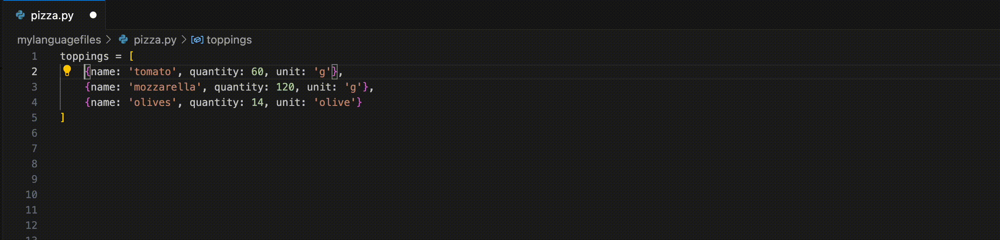
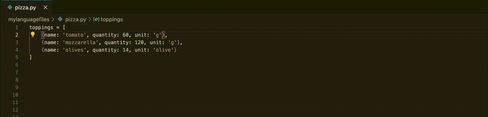

# tASTe: The AST Editor

Editing code often involves dealing with low-level textual representations, which can be tedious and error-prone.

**tASTe is a vscode extension to edit code based on its structure**, allowing you to interact more directly with the elements that make up your language.

For example, when your cursor is inside a for loop, you can invoke a command to select the whole loop at once.

Or, if you have a list of elements, tASTe gives you a command to jump from one element to the next, or
expand the current selection from one element to te next.
This works equally well with strings in a list as it does with other syntactic elements of many languages;
you can for instance jump between code blocks (to jump from one function to the next for example), or select
markdown paragraphs one after the other.

The theme of this plugin is to do away with some of the tediousness of editing code by raising the level of abstraction,
so as to end up a little closer to manipulating the _concepts_ inherent to your programming language instead of _characters_.
Hopefully resulting in less errors and more fun :)

## Commands

### Expand and Contract Selection

- `taste.ExpandSelection`
- `taste.ContractSelection`


### Grow and Shrink Selection

- `taste.SelectForward`
- `taste.SelectBackward`


### Move Cursor

- `taste.MoveCursorBackward`
- `taste.MoveCursorForward`


### Select Top Level

- `taste.selectTopLevel`


### Raise

- `taste.Raise`



### Swap

- `taste.SwapForward`
- `taste.SwapBackward`



## Install instructions

1. Install from [here](https://marketplace.visualstudio.com/items?itemName=simonacca.taste)
2. Add the keyboard shortcuts you are interested in to your editor config from the Command Palette (⇧⌘P) with the "Preferences: Open Keyboard Shortcuts (JSON) command." ([docs](https://code.visualstudio.com/docs/getstarted/keybindings#_advanced-customization))

Here's some suggested ones:

```json
{
  "key": "cmd+e",
  "command": "taste.ExpandSelection"
},
{
  "key": "cmd+shift+e",
  "command": "taste.ContractSelection"
},
{
  "key": "shift+cmd+left",
  "command": "taste.SelectBackward"
},
{
  "key": "shift+cmd+right",
  "command": "taste.SelectForward"
},
{
  "key": "cmd+right",
  "command": "taste.MoveCursorForward"
},
{
  "key": "cmd+left",
  "command": "taste.MoveCursorBackward"
}
```

## Supported languages

- Bash
- C
- C Sharp
- Common Lisp
- C++
- Cap'n Proto
- CSV
- CSS
- Dart
- Dockerfile
- DOT
- Elixir
- Erlang
- Fish
- Go
- Graphql
- Hack
- Haskell
- HCL (Terraform)
- HTML
- Java
- Javascript
- JSON
- Julia
- Kotlin
- Lua
- Markdown
- Matlab
- Nix
- Objective C
- PHP
- Python
- QML
- R
- Racket
- Rust
- Ruby
- Scala
- Scheme
- SCSS
- Scheme
- SQL
- Swift
- Toml
- TSV
- Typescript
- XML
- YAML
- Zig

## Troubleshooting

### Unrecognized language

If you get the message "The language ... is not yet supported by tASTe" but the language of my file listed as supported in this readme,
it could be that vscode cannot auto-detect the language in question.
You can verify this by checking that the language is shown correctly in the bottom-right corner of vscode.

In case it's not shown correctly, you might need to install an extension that enables support for your language.

If the language is already recognized correctly and you still get the "language not supported" error, the problem is probably that the languageId assigned
by vscode to your language does not coincide with the one used by tree-sitter. Please open an issue!

## Credits

Credit for this idea goes to the long lineage of lisp structured editors, with a special shoutout to Emac's [paredit](https://paredit.org/) and vscode's [Calva](https://calva.io/). A special thank you also to the developers of [Tree-sitter](https://tree-sitter.github.io/tree-sitter/) and its many parsers, without which this wouldn't be possible.

## Dev HOWTOs

### Bringup development environment

1. Make sure you have installed the following:

- [emscripten compiler](https://github.com/emscripten-core/emscripten)
- nodejs
- docker (optional)
- gnu parallel (optional)

2. `npm install`
3. `npm build-parsers`
4. `npm run build-watch`
5. In the "Run and Debug" menu of vscode, Start debugging the "Run Extension" target

### Publish

1. `npm run check`
2. Bump version number in `package.json`
3. Write changelog
4. `git commit -m 'Bump'`
5. `npm run tag-n-push`
6. `npm run clean`
7. `npm run build-parsers`
8. `npm run publish`

#### Get Personal access token

This only applies if you are the extension publisher (simonacca).

[Instructions](https://code.visualstudio.com/api/working-with-extensions/publishing-extension#get-a-personal-access-token), [PAT tab](https://dev.azure.com/simonacca/_usersSettings/tokens).

### Rebuild parsers

1. `npm build-parsers`

### Configure a new language

1. Check [open and closed issues](https://github.com/simonacca/tASTe/issues?q=label%3Alanguage-support) first tagged with `language-support`, that's where unsuccessful attempts at adding languages are documented.
2. Install the parser `npm i tree-sitter-mylanguage`
3. Add a line to the `build_wasm.sh` script to generate the grammar
4. List the language in `languageID2ParserName`
5. Add an entry to `excludeNodeTypes` corresponding to the language

### A language is installed and built but not recognized

Add an entry in `src/languages.ts` -> `languageIDTranslation` mapping the vscode `languageID` to the wasm name (see `build-parsers.sh` -> `build_parser <node_module_name> <wasm_name>`).
