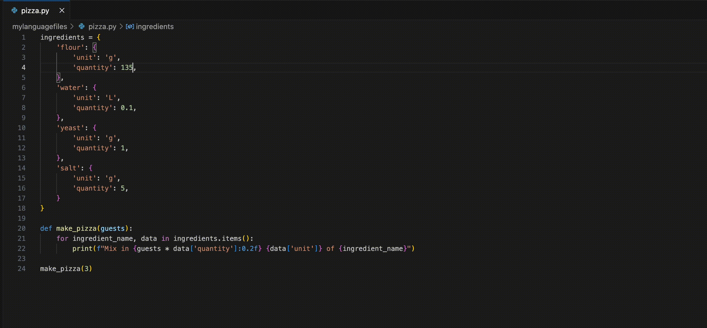
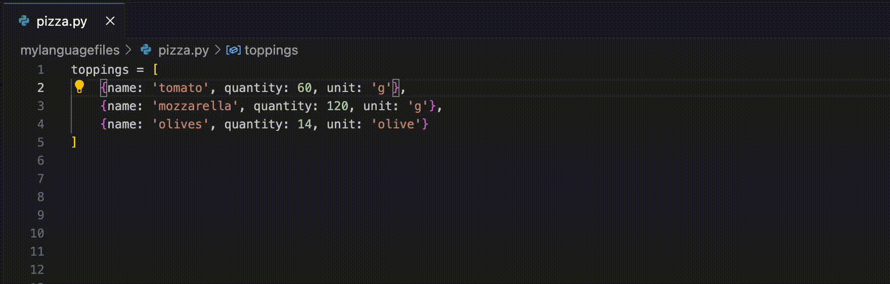
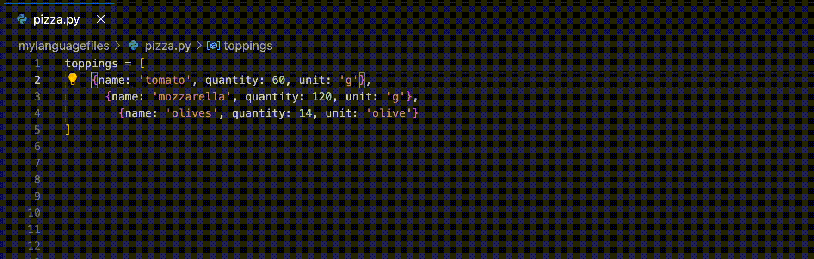
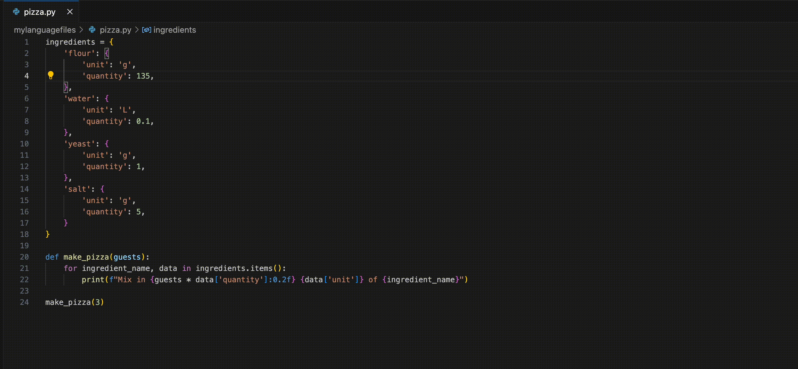

# tASTe: The AST Editor

tASTe is a vscode extension to edit code based on its structure (the AST).

## Commands

### Expand and Contract Selection

- `taste.expandSelection`
- `taste.contractSelection`



### Grow and Shrink Selection

- `taste.growOrShrinkSelectionFocusRight`
- `taste.growOrShrinkSelectionFocusLeft`



### Move Cursor

- `taste.moveCursorLeft`
- `taste.moveCursorRight`



### Select Top Level

- `taste.selectTopLevel`



## Install instructions

1. Install from [here](https://marketplace.visualstudio.com/items?itemName=simonacca.taste)
2. Add the keyboard shortcuts you are interested in to your editor config from the Command Palette (⇧⌘P) with the "Preferences: Open Keyboard Shortcuts (JSON) command." ([docs](https://code.visualstudio.com/docs/getstarted/keybindings#_advanced-customization))

Here's some suggested ones:

```json
{
  "key": "cmd+e",
  "command": "taste.expandSelection"
},
{
  "key": "cmd+shift+e",
  "command": "taste.contractSelection"
},
{
  "key": "shift+cmd+left",
  "command": "taste.growOrShrinkSelectionFocusLeft"
},
{
  "key": "shift+cmd+right",
  "command": "taste.growOrShrinkSelectionFocusRight"
},
{
  "key": "cmd+right",
  "command": "taste.moveCursorRight"
},
{
  "key": "cmd+left",
  "command": "taste.moveCursorLeft"
}
```

## Supported languages

- Bash
- C
- C++
- C Sharp
- Common Lisp
- Cap'n Proto
- Cobol
- CSS
- Cuda
- Dart
- DOT
- Elixir
- Erlang
- Fish
- Go
- Go mod
- Graphql
- Hack
- Haskell
- HCL (Terraform)
- HTML
- Java
- Javascript
- JQ
- JSON
- Julia
- Kotlin
- Lua
- Markdown
- Matlab
- Nix
- Protobuf
- Python
- QML
- R
- Racket
- Rust
- Ruby
- Scala
- SCSS
- Scheme
- SQL
- Swift
- Toml
- Typescript
- Zig

## Credits

Credit for this idea goes to the long lineage of lisp structured editors, with a special shoutout to Emac's [paredit](https://paredit.org/) and vscode's [Calva](https://calva.io/). A special thank you also to the developers of [Tree-sitter](https://tree-sitter.github.io/tree-sitter/) and its many parsers, without which this wouldn't be possible.

## Dev HOWTOs

### Bringup development environment

1. Make sure you have installed the following:

- [typescript compiler](https://www.typescriptlang.org/download)
- [emscripten compiler](https://github.com/emscripten-core/emscripten)
- nodejs
- docker
- gnu parallel (optional)

2. `npm install`
3. `npm build-parsers`
4. `npm run watch`
5. In the "Run and Debug" menu of vscode, Start debugging the "Run Extension" target

### Publish

1. Bump version number in `package.json`
2. `npm run clean`
3. `npm run build-parsers`
4. `npm run vscode:prepublish`
5. `npm run package`
6. `npm run publish`

### Rebuild parsers

1. `npm build-parsers`

### Configure a new language

1. Install the parser `npm i tree-sitter-mylanguage`
2. Add a line to the `build_wasm.sh` script to generate the grammar
3. List the language in `languageID2ParserName`
4. Add an entry to `excludeNodeTypes` corresponding to the language

### A language is installed and built but not recognized

Add an entry in `src/languages.ts` -> `languageIDTranslation` mapping the vscode `languageID` to the wasm name (see `build-parsers.sh` -> `build_parser <node_module_name> <wasm_name>`).
